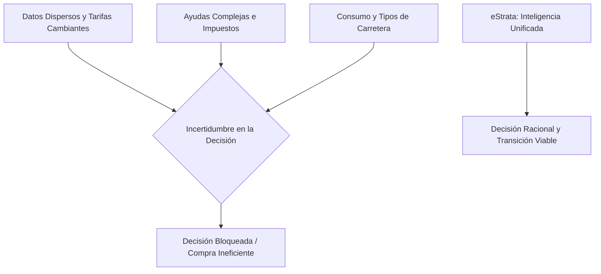
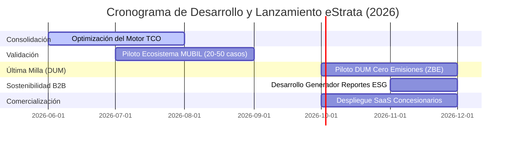

# Memoria de Proyecto — eStrata
## Plataforma de inteligencia para la toma de decisiones en movilidad eléctrica
### Candidatura MUBIL Mobility Awards 2026

---

### B.1. Ámbito: encaje en la estrategia MUBIL
eStrata se enmarca principalmente en el ámbito de la **movilidad eléctrica e infraestructuras relacionadas**, resolviendo la incertidumbre crítica previa a la compra o renovación de vehículos (tanto particulares como flotas corporativas). La plataforma actúa como un integrador inteligente que convierte datos de consumo, perfiles viales, tarifas eléctricas, red de recarga, fiscalidad y ayudas vigentes en una recomendación financiera y operativa personalizada y trazable.

El encaje con MUBIL es directo y bidireccional:
*   **Aceleración de la movilidad eléctrica**: No es un simple portal informativo, sino un consultor inteligente de viabilidad que facilita y agiliza decisiones de adquisición.
*   **Planificación de infraestructuras**: Aporta capas de análisis territorial para optimizar el despliegue de redes de recarga, reduciendo el riesgo de inversiones ineficientes.
*   **Movilidad conectada y digital**: Utiliza fuentes abiertas y flujos de datos en tiempo real (tráfico, precios y cartografía) para generar servicios digitales de valor añadido para concesionarios, gestoras de flotas, operadores de recarga y administraciones públicas.

---

### B.2. Equipo Emprendedor
El equipo promotor combina criterio técnico-industrial con capacidad de desarrollo tecnológico a escala, garantizando robustez en la metodología de cálculo y capacidad de ejecución software.

| Persona | Perfil y Aportación al Proyecto |
| :--- | :--- |
| **Jon Iragorri Ormazabal** | Ingeniero Industrial especializado en mecánica estructural y gestión de proyectos industriales. Lidera el diseño de producto, el modelo financiero de decisión TCO, los perfiles de conducción reales, la calibración de variables de amortización y la coordinación comercial B2B. |
| **Imanol Areizaga Ugarte** | Ingeniero Industrial y Desarrollador Fullstack especializado en ingeniería de datos, sistemas de información geográfica (GIS), análisis territorial y soluciones de inteligencia artificial. Lidera la arquitectura de datos, el desarrollo del backend, la integración de flujos de APIs oficiales y la visualización interactiva. |

*Organigrama inicial*: Jon Iragorri asume la dirección de producto y validación del modelo de decisión; Imanol Areizaga asume la dirección tecnológica y arquitectura de la plataforma; la prospección de mercado, alianzas B2B y despliegue de pilotos se gestionan de forma compartida.

---

### B.3. Capital Social y Financiación
eStrata se encuentra en una fase emprendedora inicial, previa a la constitución formal de la sociedad mercantil, la cual se proyecta realizar tras la validación de los primeros pilotos con agentes del ecosistema MUBIL. El proyecto se ha autofinanciado en su totalidad mediante recursos propios del equipo promotor, sin deuda asociada, subvenciones previas ni inversores externos.

Esta independencia financiera proporciona al proyecto una agilidad total para iterar el modelo y orientarlo al encaje de mercado. La participación en los MUBIL Mobility Awards se plantea como la palanca clave para acceder a contraste experto, interactuar con el ecosistema de movilidad y asegurar los primeros acuerdos B2B2C.

---

### B.4. Solución/Producto: Problema, Solución e Innovación

#### Problema Identificado
La adopción de la movilidad eléctrica está bloqueada por un **problema de decisión**. La información necesaria para valorar si un vehículo eléctrico compensa frente a uno térmico (precios reales, consumos reales según trayectos, coste de recarga doméstica o pública, subvenciones aplicables, depreciación y fiscalidad) existe, pero está fragmentada, dispersa y en constante cambio. 

Ante esta complejidad, los usuarios recurren a estimaciones parciales. Esto provoca dos ineficiencias graves: retrasos injustificados en compras viables de vehículos eléctricos, o adquisiciones ineficientes que no cumplen con los requisitos mínimos de uso o rentabilidad operativa.

#### Solución Propuesta
eStrata ofrece una **plataforma inteligente de decisión** accesible en **https://estrata.eus/** que unifica e integra estas variables en un cálculo honesto del Coste Total de Propiedad (TCO), acompañando el resultado de una recomendación interactiva con inteligencia artificial.

La plataforma se despliega en **seis módulos interactivos** totalmente funcionales en su backend:

1.  **Advisor (Consultor de Viabilidad)**: Evalúa costes financieros a 10 años comparando vehículos térmicos y eléctricos. Integra un **asistente conversacional con inteligencia artificial proactiva** que guía y asiste al usuario en tiempo real en cada pantalla (sugiriendo consumos estimados, aclarando perfiles de kilómetros anuales o recomendando modelos) y le explica de forma transparente la recomendación final TCO y las ayudas correspondientes.
2.  **Ask (Asistente de Ayudas y Normativa)**: Chatbot conversacional inteligente alimentado con normativa legal e industrial oficial (como las bases reguladoras del nuevo *Programa Auto+* de MINTUR de 400 M€ que sustituye al Moves III) para resolver dudas de manera inmediata y contextualizada.
3.  **Route (Planificador de Viajes)**: Planifica trayectos de larga distancia, estimando la curva de descarga de la batería en función de la orografía y proponiendo paradas óptimas en cargadores rápidos de la red de carreteras de Euskadi y del Estado.
4.  **Mapa (Visualizador de Infraestructura)**: Mapa interactivo que consolida la red estatal de puntos de carga públicos y estaciones de combustible tradicionales, permitiendo filtrar por operador y potencia en tiempo real.
5.  **Plan (Análisis de Demanda Territorial)**: Mapa de calor por hexágonos H3 que proyecta el volumen de demanda de carga a 3 y 5 años vista para orientar la planificación de cargadores públicos.
6.  **News (Observatorio de Actualidad)**: Rastreador inteligente de noticias sectoriales y novedades legislativas que procesa, resume y destaca modificaciones que puedan alterar el análisis TCO de los usuarios.

#### Evolución Tecnológica y Nuevas Líneas de Valor Añadido
El crecimiento de eStrata contempla ampliar el alcance del motor de rutas y del Advisor incorporando dos funcionalidades que aportan un alto valor añadido a flotas comerciales B2B y son viables con su arquitectura actual:

1.  **Optimización de Rutas de Última Milla (DUM)**: Módulo dirigido a operadores logísticos locales para planificar rutas de furgonetas de reparto (e-vans) en entornos urbanos. El algoritmo de enrutamiento multi-parada optimiza el trayecto diario considerando las restricciones de las Zonas de Bajas Emisiones (ZBE) en Donostia, Bilbao y Vitoria-Gasteiz, y programa paradas de micro-recargas rápidas de oportunidad (10-15 minutos) durante las operaciones de carga y descarga en muelles de entrega.
2.  **Reportes de Huella de Carbono e Informes ESG**: Generador automatizado de certificados de reducción de emisiones y ahorro de CO₂ de las flotas comerciales simuladas. El sistema cruza los perfiles viales y trayectos reales para emitir auditorías ambientales listas para la justificación de los reportes de sostenibilidad ESG exigidos por la directiva europea CSRD.

---

### B.5. Ventaja Competitiva

La diferenciación de eStrata reside en la consolidación en una sola plataforma de elementos que el mercado ofrece de manera inconexa:

| Alternativa Existente | Limitación Habitual | Diferenciación de eStrata |
| :--- | :--- | :--- |
| **Comparadores de Coches** | Foco en diseño y precio de catálogo, ignorando costes operativos variables o TCO. | Integra TCO a 10 años ajustado al kilometraje real, depreciación y perfil de vía del usuario. |
| **Calculadoras de Fabricantes o Utilities** | Condicionadas por intereses de venta del coche o de contratación de su tarifa de energía. | Recomendación 100% neutral e independiente. Muestra las fuentes y desgloses de coste de luz. |
| **Mapas de Recarga** | Únicamente informan de ubicaciones, sin relacionarlo con la viabilidad financiera del viaje. | Vincula la red física con el planificador de rutas y el cálculo de costes de energía en Advisor. |
| **Auditorías de Flotas Manuales** | Procesos costosos en consultoría, estáticos y difícilmente actualizables. | Herramienta escalable (SaaS) con actualización automatizada de combustibles y luz. |

---

### B.6. Mercado: Tamaño, Necesidad y Acceso

El mercado potencial de eStrata abarca todas las decisiones de renovación de vehículos e implantación de infraestructura de carga en España y Europa durante la próxima década. El acceso al mercado se estructura bajo tres vectores:

*   **Particulares y Autónomos (B2C)**: Acceso libre en la web para captación de datos de mercado, validación de la experiencia de usuario y viralidad.
*   **Concesionarios, Renting y Gestores de Flotas (B2B2C)**: Herramienta de venta consultiva para simplificar la explicación del ahorro del coche eléctrico en el punto de venta, o para auditorías masivas de transición en flotas de pymes y empresas.
*   **Administraciones Públicas (B2G)**: Suministro de datos e inteligencia territorial sobre demanda proyectada y vacíos en la red de recarga pública.

---

### B.7. Modelo de Negocio
Se plantea un modelo SaaS (Software as a Service) B2B2C escalable basado en tres líneas de monetización:

*   **SaaS Concesionarios y Renting**: Suscripción recurrente (150-500 €/mes por punto de venta) para acceso a informes personalizados con la marca corporativa e integración del Advisor en su web.
*   **Auditorías de Flota**: Venta de informes ejecutivos y priorización de electrificación para empresas (200-1.500 € por análisis).
*   **Inteligencia Territorial (Plan)**: Acceso a mapas y licencias de planificación de cargadores para operadores de recarga y municipios locales.

---

### B.8. Impacto y Potencial
El impacto de eStrata se orienta a la aceleración racional de la movilidad sostenible:

*   **Ambiental**: Identifica y prioriza la electrificación de los vehículos térmicos con mayor kilometraje urbano, maximizando la reducción de emisiones de CO2 por euro invertido.
*   **Económico**: Asegura que las inversiones en flotas y cargadores sean financieramente sostenibles, acortando los plazos de retorno de inversión.
*   **Social**: Democratiza el acceso a la consultoría de transición, dotando al ciudadano de una herramienta rigurosa para decidir con confianza.

---

### B.9. Plan de Trabajo y Recursos Necesarios

#### Grado de Desarrollo Actual (Nivel de Madurez Tecnológica)
eStrata ha superado la fase conceptual. Cuenta con un prototipo funcional avanzado en producción en **https://estrata.eus/**. Todos los motores de cálculo, algoritmos de rutas, asistentes conversacionales inteligentes y flujos de datos funcionan sobre bases de datos operativas en tiempo real.

| Módulo | Funcionalidad Backend Implementada | Estado actual | Siguiente Paso de Desarrollo |
| :--- | :--- | :--- | :--- |
| **Advisor** | Cálculo TCO exacto por tipo de vía, integración de precios PVPC y asistente de IA proactivo en formulario. | 100% Funcional | Exportación a informes ejecutivos en formato PDF para flotas. |
| **Ask** | Búsqueda por similitud de textos vectoriales combinando normativa Auto+ y noticias sectoriales. | 100% Funcional | Refinamiento de tiempos de respuesta del asistente conversacional. |
| **Route** | Motor de georouting sobre topología de carreteras de Euskadi y del Estado. | 100% Funcional | Visualización avanzada de la curva de descarga de batería en el mapa. |
| **Mapa** | Carga y deduplicación en tiempo real de más de 11.000 gasolineras y red de cargadores. | 100% Funcional | Filtros por disponibilidad en tiempo real del cargador. |
| **Plan** | Algoritmo predictivo geoespacial utilizando mapas H3 y datos históricos. | Funcional (datos precargados) | Automatización del cálculo con feeds dinámicos de tráfico. |
| **News** | Agregación de prensa del sector con traducción y resumen automático. | 100% Funcional | Interfaz pública de consulta cronológica. |

#### Origen y Flujo Automatizado de Datos
La fiabilidad técnica de eStrata radica en la integración de flujos de datos oficiales:
1.  **Combustibles**: Actualización diaria mediante conexión con la API del **Ministerio para la Transición Ecológica (MITECO / MINCOTUR)**.
2.  **Tarifas de luz**: Precios horarios PVPC consumidos directamente desde la API oficial de **ESIOS (Red Eléctrica de España)**.
3.  **Catálogo de Vehículos**: Homologaciones oficiales WLTP procedentes de la base de datos de **IDAE**.
4.  **Cargadores de Acceso Público**: Consolidación y filtrado de cargadores procedentes de **OpenData Euskadi**, **MITECO**, el Punto de Acceso Nacional de Tráfico (**DGT NAP**) y **OpenChargeMap**.
5.  **Flujos de Movilidad**: Matriculaciones históricas de la **DGT** y Big Data interurbano origen-destino del **Ministerio de Transportes (MITMA)**.

#### Cronograma y Próximos Hitos

1.  **Fase 1: Consolidación (Meses 0-3)**: Depurar el motor TCO del Advisor y validar las fuentes con un conjunto inicial de 20 casos reales.
2.  **Fase 2: Piloto de Validación MUBIL (Meses 3-6)**: Puesta en marcha de un piloto experimental con un agente del ecosistema de MUBIL (concesionario o gestor de flotas) analizando entre 20 y 50 casos reales de compra para calibrar la precisión del Advisor.
3.  **Fase 3: Piloto eStrata DUM - Última Milla Cero Emisiones (Meses 5-8)**: Proyecto piloto experimental en colaboración con un operador de reparto urbano local y un ayuntamiento de la CAV. Se validará el nuevo algoritmo de enrutamiento multi-parada y recargas de oportunidad frente a las ZBE de Donostia, Bilbao y Vitoria-Gasteiz.
4.  **Fase 4: Comercialización e Informes ESG (Meses 6-12)**: Lanzamiento de la versión comercial SaaS para concesionarios, integración del módulo de rutas capilar para reparto DUM e implementación del generador automático de informes ESG de huella de carbono para flotas de empresas.

---

### B.10. Protecciones Legales
La protección del proyecto combina la seguridad de la propiedad intelectual con el cumplimiento normativo:
*   **Software e Interfaces**: Derechos de autor y copyright sobre el código original del backend, frontend, algoritmos de cálculo y configuraciones del asistente.
*   **Marca**: Registro de la marca eStrata y dominios de internet asociados.
*   **Know-how y Secreto Industrial**: Protección de la metodología de integración de datos, factor de sinuosidad de rutas y ponderación del mix de carga.
*   **Cumplimiento RGPD**: Política estricta de minimización y anonimización de datos de los perfiles de conducción y códigos postales consultados.

---

### B.11. Indicadores Financieros: Histórico y Proyecciones

Las proyecciones se basan en una estructura ágil orientada al crecimiento SaaS:

| Concepto Financiero | Año 1 | Año 2 | Año 3 |
| :--- | :--- | :--- | :--- |
| **Ingresos por Pilotos y Flotas** | 12.000 € | 45.000 € | 80.000 € |
| **Suscripciones SaaS (B2B)** | 3.000 € | 25.000 € | 75.000 € |
| **Ingresos Totales** | **15.000 €** | **70.000 €** | **155.000 €** |
| **Costes Operativos (Servidores, APIs)** | 8.000 € | 22.000 € | 45.000 € |
| **Resultado Neto Estimado** | **+7.000 €** | **+48.000 €** | **+110.000 €** |

*Métricas de seguimiento clave*: Número de simulaciones Advisor completadas, tasa de recurrencia en búsquedas Ask, margen operativo por informe de flota, y porcentaje de conversión de pilotos B2B a licencias SaaS.
