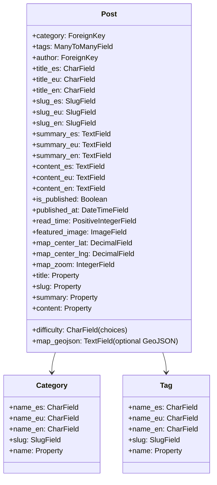

# Design: Blog App with Interactive GIS & AI

## Context
We are implementing a blog application within a Django 6.0 ecosystem configured with TailwindCSS 3.x, Alpine.js, HTMX, and Django Cotton. The site already handles Basque (`eu`), Spanish (`es`), and English (`en`) via `LocaleMiddleware`.

## Goals / Non-Goals

### Goals:
- Implement trilingual models for categories, tags, and posts.
- Maintain consistency with existing GIS map integrations (Leaflet) and AI advisor patterns (Gemini API).
- Provide a premium, responsive layout for lists and reading details (with reading time, difficulty, tags, and category navigation).
- Allow posts to display interactive geo-spatial visualizations (maps) inside their pages.
- Add an AI search/FAQ chat panel on the sidebar.

### Non-Goals:
- A comments system (keep it simple, leverage external links or standard feedback).
- Complex standalone database schemas for user comments.

## Technical Architecture & Decisions

### 1. Database Schema & i18n
We will use suffix fields to store translations directly in the model. This keeps the schema flat, queries fast, and matches the pattern in the `gailur` app.



**Translation Property Getter Example:**
```python
@property
def title(self):
    lang = get_language()
    if lang == "eu" and self.title_eu:
        return self.title_eu
    if lang == "en" and self.title_en:
        return self.title_en
    return self.title_es or self.title_eu or self.title_en or "Untitled"
```

### 2. URL Routing
To support search and cross-language sharing, the blog will mount under `/blog/`. 
The detail page will match slug:
`path("<slug:slug>/", views.post_detail, name="post_detail")`
Inside `views.post_detail`, we will search across all three language slug fields:
```python
post = get_object_or_400(
    Post.objects.filter(is_published=True),
    Q(slug_eu=slug) | Q(slug_es=slug) | Q(slug_en=slug)
)
```
If the slug visited is not the slug of the active language, we will let it load, but ensure that links to other pages use the active language slugs.

### 3. Interactive WebGIS Map Widget
If `map_geojson` is populated, the post detail page will load Leaflet in the `<head>` and render a container `<div id="post-map" class="h-80 w-full rounded-2xl shadow-inner mb-6"></div>`.
An inline script will initialize the map:
```javascript
const map = L.map('post-map').setView([{{ post.map_center_lat }}, {{ post.map_center_lng }}], {{ post.map_zoom }});
L.tileLayer('https://{s}.tile.openstreetmap.org/{z}/{x}/{y}.png', { ... }).addTo(map);

const geojsonData = {{ post.map_geojson|safe }};
L.geoJSON(geojsonData).addTo(map);

```

### 4. AI Assistant Chatbot (Gemini Integration)
In the blog template sidebar, we include an Alpine.js chatbot component that sends questions to `/blog/api/chat/` via HTMX or fetch.
The view will:
1. Search published posts for keyword matches (to fetch relevant posts).
2. Format the top 3-5 articles into a simple context string.
3. Call the Gemini API (`client.models.generate_content`) using `gemini-3.5-flash` or the first available fallback model from `settings.GEMINI_GENERATION_FALLBACK_MODELS`.
4. Return a markdown response containing the answer and citations referencing relevant posts.

## Risks / Trade-offs
- **Language Slugs Collisions**: Multiple slugs could collide.
  - *Mitigation*: Ensure uniqueness constraints or handle slug collision validation in Django Admin save methods.
- **GeoJSON Validity**: Incorrect GeoJSON strings could break the frontend map.
  - *Mitigation*: Wrap Leaflet parsing in a try-catch block to avoid crashing the page.
